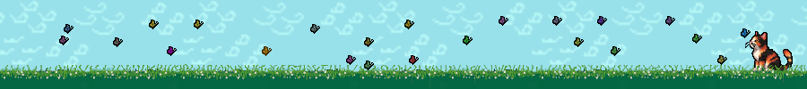

# Pixelcat theme

A custom animated Firefox theme featuring pixel-art cats and looping APNG backgrounds.

## Features
- Custom manifest.json
- Animated panel with pixel art
- Compatible with Firefox and LibreWolf
- Built using APNG and CSS

## Preview

## Download

You can install this theme directly from the official Firefox Add-ons page:

 -> 
[Install on Firefox](https://addons.mozilla.org/en-US/firefox/addon/animated-butterfly-pixelcat/)

## Installation temporary or debugging
1. Open `about:debugging` in Firefox
2. Load the `manifest.json` as a temporary addon

## License
This theme is licensed under the Creative Commons Attribution-ShareAlike 4.0 International License.  
See the [LICENSE](LICENSE) file for full license text.
