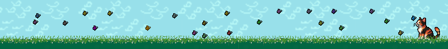

# Animated Firefox Themes

A collection of custom animated Firefox themes featuring pixel-art animations and looping APNG backgrounds. Compatible with Firefox and LibreWolf.

---

## Themes Catalog

### 1. Pixelcat (Cat Butterfly Wind)

A relaxing pixel-art animated theme featuring a cat looking into the wind with butterflies.

- **Folder:** [`themes/pixelcat/`](./themes/pixelcat/)
- **Version:** 1.5.0
- **AMO Add-on:** [Install on Firefox Add-ons](https://addons.mozilla.org/en-US/firefox/addon/animated-butterfly-pixelcat/)
- **Direct Download (.xpi):** [Download `pixelcat.xpi`](https://github.com/0gerardo0/animated-firefox-theme/releases/latest/download/pixelcat.xpi)
- [](https://addons.mozilla.org/en-US/firefox/addon/animated-butterfly-pixelcat/)

#### Preview


---

### 2. Pixel LibreWolf (Wolf in the Rain)

A pixel-art animated theme dedicated to LibreWolf, featuring a sitting wolf in the rain with a celestial LibreWolf logo watermark glowing in the sky.

- **Folder:** [`themes/pixellibrewolf/`](./themes/pixellibrewolf/)
- **Version:** 1.0.0
- **AMO Add-on:** [Install on Firefox Add-ons](https://addons.mozilla.org/en-US/firefox/addon/animated-librewolf-pixel/)
- **Direct Download (.xpi):** [Download `pixellibrewolf.xpi`](https://github.com/0gerardo0/animated-firefox-theme/releases/latest/download/pixellibrewolf.xpi)
- [](https://addons.mozilla.org/en-US/firefox/addon/animated-librewolf-pixel/)

#### Preview


---

## How to Install Downloaded `.xpi` Packages

1. Download the `.xpi` file of your choice from the [GitHub Releases](https://github.com/0gerardo0/animated-firefox-theme/releases) section.
2. Open Firefox or LibreWolf.
3. Drag and drop the `.xpi` file directly into your browser window (or press `Ctrl + O` and select it).
4. Click **"Add"** (*Añadir*) when prompted by the browser.

---

## Local Testing & Debugging

1. Open `about:debugging` in Firefox or LibreWolf.
2. Click **"This Firefox"** (or **"Load Temporary Add-on..."**).
3. Select the `manifest.json` of the theme you want to test (for example: `themes/pixellibrewolf/manifest.json`).
4. The theme applies immediately without compiling.

---

## Building / Packaging for AMO & GitHub Releases

Each theme can be packaged into an `.xpi` file ready for submission to [Firefox Add-on Developer Hub (AMO)](https://addons.mozilla.org/developers/) or GitHub Releases:

```bash
# Package a specific theme
./package.sh pixelcat
./package.sh pixellibrewolf

# Package all themes in themes/
./package.sh --all
```

The generated `.xpi` packages will be placed in the `dist/` folder:
- `dist/pixelcat.xpi`
- `dist/pixellibrewolf.xpi`

### Publishing a New Release on GitHub
A GitHub Actions workflow is included. To release automatically:
1. Create and push a git tag:
   ```bash
   git tag v2.0.0
   git push origin v2.0.0
   ```
2. GitHub Actions will automatically package all themes and publish them as downloadable assets in the new release.

---

## Adding a New Theme

1. Create a new directory inside `themes/`:
   ```bash
   mkdir themes/<mi-nuevo-tema>
   ```
2. Copy or create:
   - `manifest.json` with a unique name, version, and `browser_specific_settings.gecko.id`.
   - Your animated APNG image (e.g. `frame.png`).
   - An icon (`icon.svg` or `icon.png`).
3. Package it:
   ```bash
   ./package.sh <mi-nuevo-tema>
   ```

---

## License

This project is licensed under the Creative Commons Attribution-ShareAlike 4.0 International License.  
See the [LICENSE](LICENSE) file for full license text.
